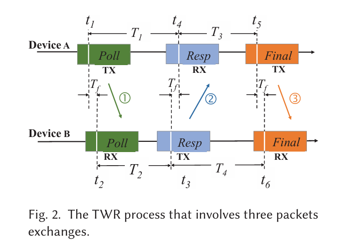
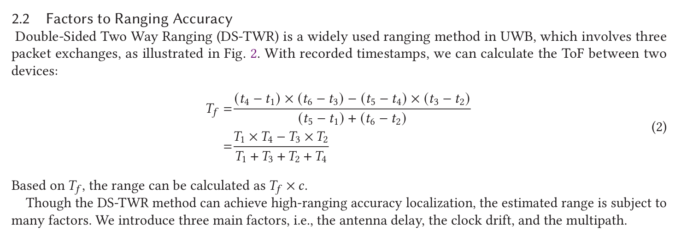
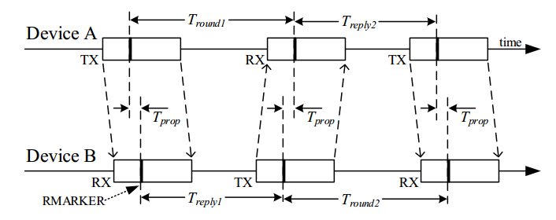

# DS-TWR测距原理以及公式推导

## **起因：**

近期在做有关UWB定位的项目，今天看了一篇论文：

*VULoc: Accurate UWB Localization for Countless Targets without Synchronization*

里面有讲到影响DS-TWR测量的一些因素，顺便提了一下它的原理和公式，如下图：

是不是原理很简单？但是看到这个计算TOF的公式让我很懵逼。

于是上网找了一圈，在CSDN和知乎上发现大家都是对于SS-TWR的原理和公式给出了很详细的解释，但是对于DS-TWR只是把公式一列，然后就结束了。

还没讲明白，这怎么能结束呢？

于是秉着做科研的精神，补充一下DS-TWR的测距的公式的证明以及它是怎么来的。

## DS-TWR测距流程

如图所示，设备A发*Poll*请求，设备B收到Poll请求后经过$T_{reply1}$后发*Response*，设备A收到*Response*后经过$T_{reply2}$后再发*Final ACK*，设备B收到*Final ACK*后结束DS-TWR

## 计算TOF的公式：

$$
\tau = \frac{T_{round1} × T_{round2} − T_{reply1} × T_{reply2}  } {T_{round1} + T_{round2} + T_{reply1} + T_{reply2}}
$$

## 公式证明：
$$
T_{round1}=2 \times \tau + T_{replly1}             \ \ \ \  (1)
$$

$$
T_{round2}=2 \times \tau + T_{replly2}   \ \ \ \  (2)
$$

$$
\frac{T_{round1} × T_{round2} − T_{reply1} × T_{reply2}  } {T_{round1} + T_{round2} + T_{reply1} + T_{reply2}}=\frac{(2  \tau + T_{replly1})\times(2  \tau + T_{replly2})-T_{reply1} × T_{reply2}} {2  \tau + T_{replly1}+2  \tau + T_{replly1}+T_{reply1} + T_{reply2}}\\
=\frac{4\tau^2+2\tau({T_{reply1} + T_{reply2})+T_{reply1} × T_{reply2}-T_{reply1} × T_{reply2}}}{4  \tau +2(T_{replly1}+T_{replly1})}\\
=\tau
$$

## 公式推导：

将$(1)$和$(2)$式左右两边同时相乘，我们可以得到：
$$
T_{round1}\times T_{round2}=4\tau^2+2\tau(T_{reply1} + T_{reply2}) +T_{reply1} × T_{reply2}
$$
移项，然后等式右边提出一个$\tau$，我们可以得到
$$
T_{round1}\times T_{round2}-T_{reply1} × T_{reply2}=\tau [(2\tau+T_{reply1}) + (2\tau +T_{reply2})+T_{reply1} + T_{reply2}]\\
=\tau(T_{round1} + T_{round2} + T_{reply1} + T_{reply2})
$$

这样就算出了TOF
$$
\tau = \frac{T_{round1} × T_{round2} − T_{reply1} × T_{reply2}  } {T_{round1} + T_{round2} + T_{reply1} + T_{reply2}}
$$
从而减小了因为不同设备的不同[晶振](https://so.csdn.net/so/search?q=晶振&spm=1001.2101.3001.7020)震荡偏移误差造成的影响。

## 补充

1.影响DS-TWR测量的因素不仅与时钟偏移有关，而且也受到其他因素的影响，主要有以下三点：

1.CLock Shift

2.Antenna Delay

3.Mutipath Effect

2.关于为什么DS-TWR优于SS-TWR，可以参考这篇文章：

*Numerical and Experimental Evaluation of Error Estimation for Two-Way Ranging Methods*